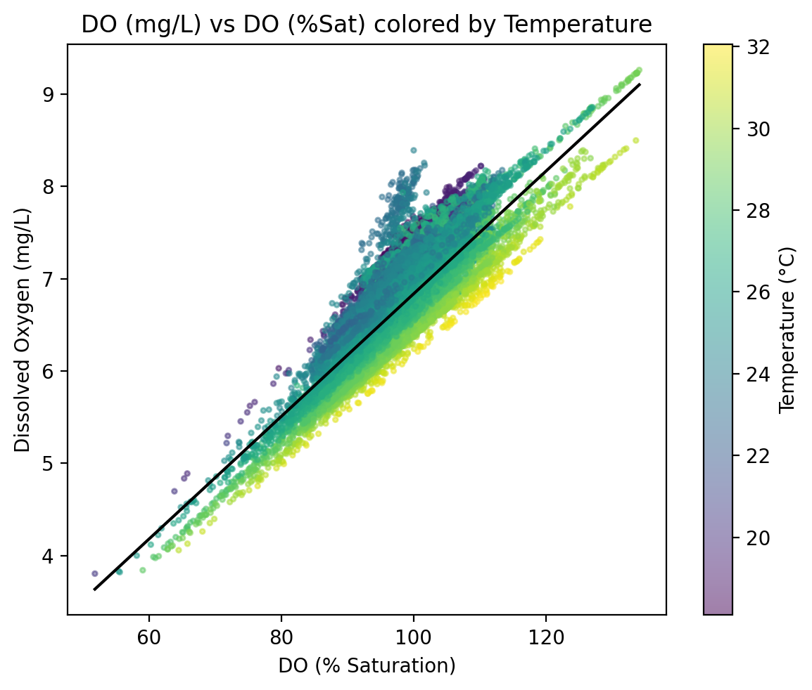
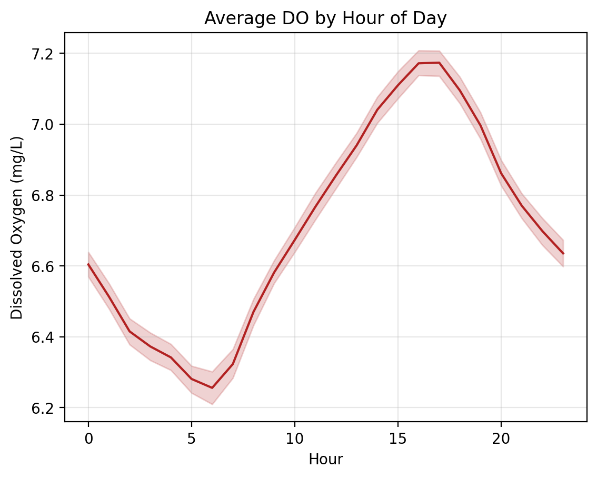
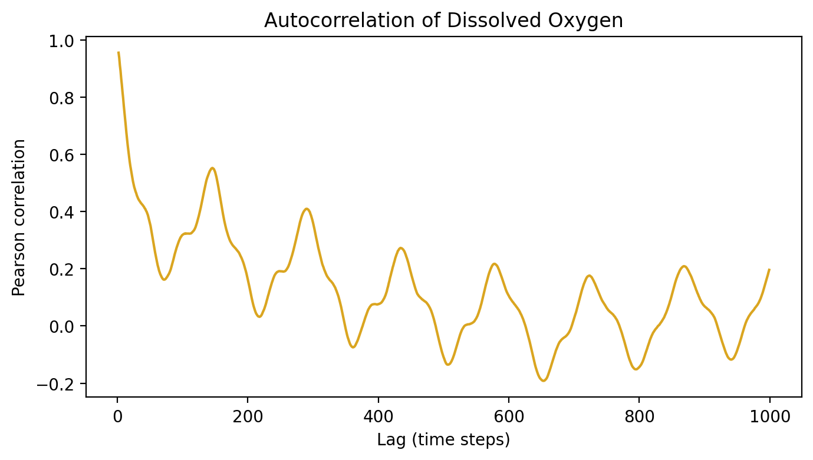

# Brisbane River Water Quality Prediction

Machine Learning Analysis of Dissolved Oxygen Dynamics in the Brisbane River

---

## Table of Contents

- [Project Overview](#project-overview)
- [Dataset](#dataset)
- [Exploratory Data Analysis](#exploratory-data-analysis)
- [Feature Engineering](#feature-engineering)
- [Data Preprocessing](#data-preprocessing)
- [Data Splitting](#data-splitting)
- [Model Pipeline](#model-pipeline)
- [Machine Learning Models](#machine-learning-models)
- [Model Comparison](#model-comparison)
- [Best Model: ElasticNet](#best-model-elasticnet)
- [Model Interpretation](#model-interpretation)
- [Repository Structure](#repository-structure)
- [Future Work](#future-work)
- [Reference](#reference)

---

# Project Overview

This project analyzes water quality data from the **Brisbane River** and builds machine learning models to predict **Dissolved Oxygen (DO)** levels over time.

Dissolved oxygen is a critical indicator of river ecosystem health. Low DO levels may indicate water pollution, oxygen depletion, and ecological imbalance. Predicting DO levels helps detect environmental risks early and supports river ecosystem monitoring.

The prediction task is formulated as a **time-series regression problem**, where historical environmental measurements are used to predict current DO levels.

---

# Dataset

Dataset source:

Brisbane River Water Quality Dataset  
https://www.kaggle.com/datasets/downshift/water-quality-monitoring-dataset

The dataset was collected from automated water quality sensors deployed at multiple monitoring locations along the Brisbane River.

### Dataset Characteristics

| Attribute | Description |
|----------|-------------|
| Sampling frequency | Every 10–30 minutes |
| Time span | 2023–2024 |
| Data type | Multivariate environmental time series |

### Variables

- Dissolved Oxygen (mg/L)
- Dissolved Oxygen (% Saturation)
- Temperature
- Salinity
- pH
- Turbidity
- Chlorophyll
- Specific Conductance
- Average Water Speed
- Average Water Direction
- Timestamp

---

# Exploratory Data Analysis

## DO vs DO(% Saturation)

Dissolved Oxygen (mg/L) shows a strong positive correlation with DO(% Saturation) (~0.88).

Higher water temperature tends to correspond with lower oxygen solubility.

---

## Average DO by Hour of Day

Dissolved Oxygen follows a clear **daily pattern**:

- Higher during the afternoon
- Lower during the night

This pattern is likely driven by photosynthesis during daylight hours.

---

## Autocorrelation

The DO time series exhibits strong autocorrelation, suggesting that previous DO measurements are strong predictors of future values.

---

# Feature Engineering

To capture temporal dependencies, **lagged features** were constructed.

Example lag features:

Temperature_lag1  
Temperature_lag2  
Dissolved_Oxygen_lag1  
Dissolved_Oxygen_lag2  

The lag order **p** is treated as a hyperparameter:

p ∈ {2, 4, 6}

These lag features allow models to learn how past environmental conditions influence current DO levels.

---

# Data Preprocessing

Different preprocessing pipelines were applied depending on model type.

### Non-linear models

StandardScaler applied to:

- Dissolved Oxygen
- Temperature
- Salinity
- Chlorophyll
- Turbidity
- Specific Conductance
- Water Speed
- Water Direction
- pH

### Linear models

StandardScaler applied to all numerical features.

Scaling ensures stable model training and allows meaningful interpretation of regression coefficients.

---

# Data Splitting

Because the dataset is temporal, random splitting would introduce data leakage.

Instead, **TimeSeriesSplit** is used to preserve chronological order.

### Splitting Strategy

| Dataset | Purpose |
|-------|--------|
| Train | Model training |
| Validation | Hyperparameter tuning |
| Test | Final evaluation |

The **most recent 10% of observations** are used as the final test set.

---

# Model Pipeline

The modeling workflow follows the steps below:

Raw Dataset  
↓  
EDA  
↓  
Lag Feature Construction  
↓  
Scaling / Preprocessing  
↓  
TimeSeries Cross Validation (5 folds)  
↓  
Hyperparameter Search  
↓  
Refit Best Model on Train + Validation  
↓  
Final Evaluation on Test Set  

Evaluation metrics:

- RMSE
- R²

---

# Machine Learning Models

Six regression algorithms were evaluated:

| Model | Type |
|------|------|
| Random Forest | Tree ensemble |
| XGBoost | Gradient boosting |
| KNN | Distance-based regression |
| SVR | Kernel regression |
| ElasticNet | Linear regression with L1 + L2 regularization |
| Ridge | Linear regression with L2 regularization |

Hyperparameters were tuned using **TimeSeries Cross Validation**.

---

# Model Comparison

Average test R² across models:

| Model | Mean R² |
|------|--------|
| ElasticNet | **0.9282** |
| Ridge | 0.9271 |
| Random Forest | 0.9257 |
| XGBoost | 0.9251 |
| SVR | 0.8615 |
| KNN | 0.819 |

ElasticNet achieved the best predictive performance.

---

# Best Model: ElasticNet

ElasticNet regression was selected as the final model due to:

- Highest predictive accuracy
- Stable cross-validation performance
- Good interpretability

Example prediction results:

---

# Model Interpretation

Three interpretation methods were used.

### Coefficient Importance

Measures standardized coefficient magnitudes.

### Permutation Importance

Measures performance decrease when feature values are randomly shuffled.

### SHAP Values

Provides global explanations for feature contributions.

Across all interpretation approaches, the most important predictors are:

- **Dissolved_Oxygen_lag1**
- **Dissolved_Oxygen_lag2**

This confirms that recent historical DO levels dominate prediction performance.

---

# Repository Structure

brisbane-water-quality-analysis

data/  
figs/  
notebooks/  
models/  
utils/  

README.md  
requirements.txt  

---

# Future Work

Potential extensions include:

- Seasonal trend analysis
- Deep learning time-series models (LSTM / Transformer)
- Multi-location river monitoring models
- Real-time forecasting dashboards

---

# Reference

Daniel Fedorov  
Water Quality Monitoring Dataset  
https://www.kaggle.com/datasets/downshift/water-quality-monitoring-dataset
